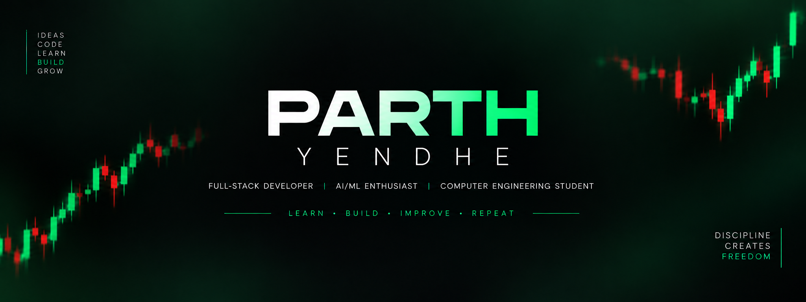

<div align="center">



<br/>

<a href="https://github.com/ParthYendhe0679">
  
</a>
<a href="https://www.linkedin.com/">
  
</a>

</div>

---

## 👋 About Me

```text
Name       : Parth Yendhe
Education  : B.E. Computer Engineering — TSEC'28
Role       : Full-Stack Developer • AI/ML Enthusiast
Interests  : AI Engineering • Backend Systems • FinTech
```

I'm a **Computer Engineering student and full-stack developer** who enjoys turning ideas into complete, practical products.

I work across **frontend, backend, databases, AI/ML, and financial technology**, with a strong interest in building systems that are useful beyond a simple demo.

### 🚀 What I Like Building

- 🤖 AI-powered applications, RAG systems & intelligent agents
- 🌐 Full-stack web applications and scalable APIs
- 📈 Trading, quantitative finance & financial intelligence systems
- 🧠 Computer vision and NLP applications
- ⚡ Backend systems using Python and Go
- 🏆 Hackathon projects focused on real-world problems

---

## 🧠 Current Focus

```text
AI Engineering       ███████████████████░░   LLMs • RAG • AI Agents
Backend Engineering  ██████████████████░░░   Go • FastAPI • Node.js
System Design        ███████████████░░░░░░   APIs • Architecture • Scalability
Quant Finance        ██████████████░░░░░░░   Trading • Backtesting • Market Data
DSA                  █████████████░░░░░░░░   Java • Problem Solving
```

---

# 🛠️ Tech Arsenal

### 👨‍💻 Programming Languages

<p>
  
</p>

**Python • Java • C++ • C**

### 🎨 Frontend

<p>
  
</p>

**React.js • Next.js**

### ⚙️ Backend

<p>
  
</p>

**Node.js • Express.js • FastAPI • Go**

### 🤖 AI / ML

<p>
  
</p>

**Machine Learning • LLMs • RAG • LangChain • NLP • Computer Vision • OpenCV • AI Agents**

### 🗄️ Databases & Storage

<p>
  
</p>

**SQL • PostgreSQL • MySQL • Redis • Firebase**

### 🔧 Tools & Development

<p>
  
</p>

**Git • GitHub • VS Code • Postman • XAMPP**

---

# 🚀 Featured Projects

### 🟢 ORBIT — AI-Powered Trading Intelligence Platform

A multi-agent financial intelligence platform combining market analysis, trading strategies, portfolio management, backtesting and automated decision support.

**Highlights:** Multi-Agent AI • Trading Strategies • Market Analysis • Backtesting • Portfolio Management • Real-Time Updates • Risk Engine

**Stack:** Go • Python • FastAPI • React/TypeScript • PostgreSQL • Redis/Valkey • AI/LLMs

---

### 🔴 KRITAGAS — AI-Powered Criminal Network Analysis

An AI-driven system for transforming unstructured investigation data into structured entities, relationships and criminal-network intelligence.

```text
Multi-Source Data
       ↓
OCR / NLP
       ↓
Entity Extraction
       ↓
Identity Resolution
       ↓
Relationship Extraction
       ↓
Network Graph
       ↓
Graph Analytics
```

**Stack:** Python • AI/ML • NLP • OCR • Graph Analytics • Neo4j • FastAPI

---

### 📈 QuantEdgeAI — AI-Powered Stock Research Platform

A financial research platform combining quantitative market data, financial analysis and news intelligence.

**Stack:** FastAPI • Python • PostgreSQL • SQLAlchemy • yfinance • News APIs • Power BI

---

### 🌍 Bharatdarshan — Tourism Intelligence Platform

A full-stack tourism platform focused on destinations, travel information and location-based experiences.

**Stack:** Next.js • React • Tailwind CSS • FastAPI • PostgreSQL

---

### 🤖 SecularAI / GitaRAG

A RAG-based conversational system exploring semantic retrieval, embeddings and LLM-powered responses across multiple knowledge sources.

**Stack:** Python • LangChain • LLMs • Embeddings • FAISS / Vector Databases

---

# 🏆 Hackathons & Building

### 🏆 Smart India Hackathon

Problem-driven engineering projects involving AI, optimization, automation and real-world systems.

### 🚀 MochaTrade YC P26

Built **ORBIT**, an AI-powered trading intelligence platform combining multiple trading strategies, AI agents, market analysis, backtesting and portfolio functionality.

### ⚡ My Building Workflow

```text
IDEA → RESEARCH → ARCHITECTURE → BUILD → TEST → SHIP
```

---

# 📊 GitHub Statistics

<div align="center">


<br/><br/>


<br/><br/>


</div>

---

# 🏅 GitHub Trophies

<div align="center">


</div>

---

# 📈 Contribution Graph

<div align="center">


</div>

> The contribution section is kept full-width so the activity timeline has no unnecessary side gaps.

---

# 💻 Coding & Problem Solving

I’m continuously improving my problem-solving skills through **DSA, competitive programming and algorithmic thinking**.

### Focus Areas

- Data Structures & Algorithms
- Java & C++ Problem Solving
- Dynamic Programming
- Graph Algorithms
- Greedy Algorithms
- Backtracking
- String Algorithms
- System Design

<div align="center">

> **Every problem solved is another step toward becoming a better engineer.**

</div>

---

# 🎯 What I'm Learning

```text
01  Advanced DSA & Problem Solving
02  Backend Engineering with Go
03  System Design & Scalable Architecture
04  AI Agents & RAG Systems
05  Quantitative Finance & Algorithmic Trading
06  Production-grade AI Applications
```

---

# 💡 Developer Philosophy

<div align="center">

### Learn • Build • Improve • Repeat

**Ideas become valuable when you build them.**

**Code becomes powerful when you understand it.**

**Projects become meaningful when they solve real problems.**

</div>

---

# 🤝 Let's Connect

<div align="center">

<a href="https://github.com/ParthYendhe0679">
  
</a>

<!-- Replace with your actual LinkedIn profile -->
<a href="https://www.linkedin.com/">
  
</a>

</div>

---

<div align="center">

## 🚀 Thanks for Visiting!


</div>
