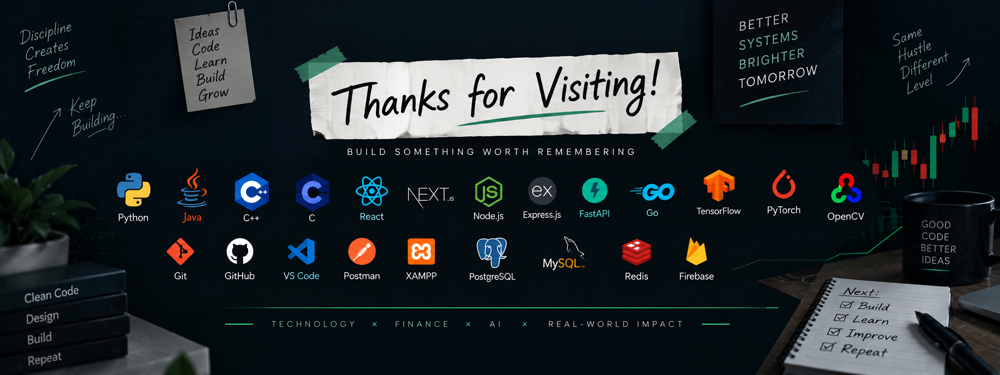

<div align="center">


<br/>

<a href="https://github.com/ParthYendhe0679">
  
</a>
<a href="https://www.linkedin.com/">
  
</a>

</div>
<br/><br/>

<h1>Hi, I'm Parth Yendhe 👋</h1>


## 👋 About Me

```text
Name       : Parth Yendhe
Education  : B.E. Computer Engineering — TSEC'28
Role       : Full-Stack Developer • AI/ML Enthusiast
Interests  : AI Engineering • Backend Systems • FinTech
```

I'm a **Computer Engineering student and full-stack developer** who enjoys turning ideas into complete, practical products.

I work across **frontend, backend, databases, AI/ML, and financial technology**, with a strong interest in building systems that are useful beyond a simple demo.

### 🚀 What I Like Building

- 🤖 AI-powered applications, RAG systems & intelligent agents
- 🌐 Full-stack web applications and scalable APIs
- 📈 Trading, quantitative finance & financial intelligence systems
- 🧠 Computer vision and NLP applications
- ⚡ Backend systems using Python and Go
- 🏆 Hackathon projects focused on real-world problems

---

## 🧠 Current Focus

```text
AI Engineering       ███████████████████░░   LLMs • RAG • AI Agents
Backend Engineering  ██████████████████░░░   Go • FastAPI • Node.js
System Design        ███████████████░░░░░░   APIs • Architecture • Scalability
Quant Finance        ██████████████░░░░░░░   Trading • Backtesting • Market Data
DSA                  █████████████░░░░░░░░   Java • Problem Solving
```

---

# 🛠️ Tech Arsenal

### 👨‍💻 Programming Languages

<p>
  
</p>

**Python • Java • C++ • C**

### 🎨 Frontend

<p>
  
</p>

**React.js • Next.js**

### ⚙️ Backend

<p>
  
</p>

**Node.js • Express.js • FastAPI • Go**

### 🤖 AI / ML

<p>
  
</p>

**Machine Learning • LLMs • RAG • LangChain • NLP • Computer Vision • OpenCV • AI Agents**

### 🗄️ Databases & Storage

<p>
  
</p>

**SQL • PostgreSQL • MySQL • Redis • Firebase**

### 🔧 Tools & Development

<p>
  
</p>

**Git • GitHub • VS Code • Postman • XAMPP**

---


# 📊 GitHub Statistics

<div align="center">


<br/><br/>


<br/><br/>


</div>


# 📈 Contribution Graph

<div align="center">


</div>

> The contribution section is kept full-width so the activity timeline has no unnecessary side gaps.

---


# 🤝 Let's Connect

<div align="center">

<a href="https://github.com/ParthYendhe0679">
  
</a>

<!-- Replace with your actual LinkedIn profile -->
<a href="https://www.linkedin.com/">
  
</a>

</div>
<div align="center">

### 💻 Building ideas into reality, one project at a time.

<br>

**Thanks for visiting my GitHub profile! 🚀**

<br><br>



<br><br>


</div>

